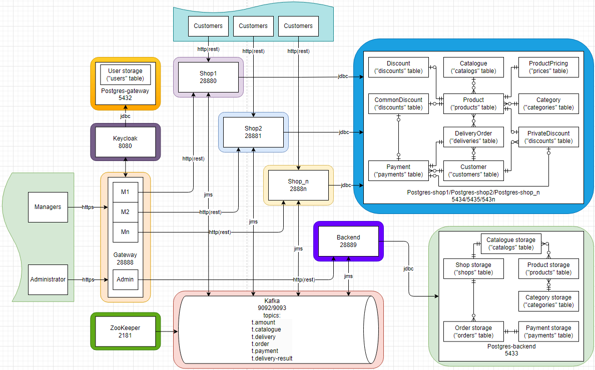

# Management control system

Microservice training project with Apache Kafka and Keycloak auth.

### Project in progress!

## Project objectives

Work in progress

## Table of Contents

* [Application 'Management control system'](#management-control-system)
    * [Project objectives](#project-objectives)
    * [Architecture](#architecture)
    * [Services](#services)
        * [Gateway service](#gateway)
        * [Backend service with PostgresQL database](#backend-with-PostgresQL-database)
        * [Shop1-n with Mongo database](#Shop1-n-with-Mongo-database)
        * [Kafka](#kafka)
        * [Zookeeper](#zookeeper)
        * [Keycloak with PostgresQL database](#keycloak-with-PostgresQL-database)
        * [Mongo-express](#mongo-express)
    * [Running Instructions](#running-instructions)
        * [Via docker](#via-docker)
            * [Usage](#usage)
                * [Get a token:](#get-a-token)
                * [Backend service:](#backend-service)
    * [References and further reading](#references-and-further-reading)

## Architecture

The microservice architectural style is an approach to developing a single application as a suite of small services, each running in its own process and communicating with lightweight mechanisms, often an HTTP resource API.


## Services

Each of the backing services must be located using a statically defined route

### Gateway

Implementation of an API gateway that is the single entry point for all managers and administrator.

### Backend with PostgresQL database
### Shop1-n with Mongo database
### Kafka
### Zookeeper
### Keycloak with PostgresQL database
### Mongo-express

## Running Instructions
### Via docker

```bash
$ cd management_control_system
$ mvn clean install
$ docker-compose up --build -d
```

#### Usage

Work in progress

#### Results

Work in progress

## References and further reading
    * http://microservices.io/

    * https://www.keycloak.org/docs-api/19.0.1/rest-api/#_users_resource
    * https://medium.com/chain-analytica/keycloak-work-with-client-roles-in-spring-boot-a34d74947c93
    * https://codersee.com/how-to-set-up-keycloak-admin-client-with-spring-boot-and-kotlin/
    * https://hub.docker.com/r/jboss/keycloak

    * https://mac-blog.org.ua/kafka-sasl-ssl
    * https://hub.docker.com/r/wurstmeister/kafka
    * https://hub.docker.com/r/wurstmeister/zookeeper